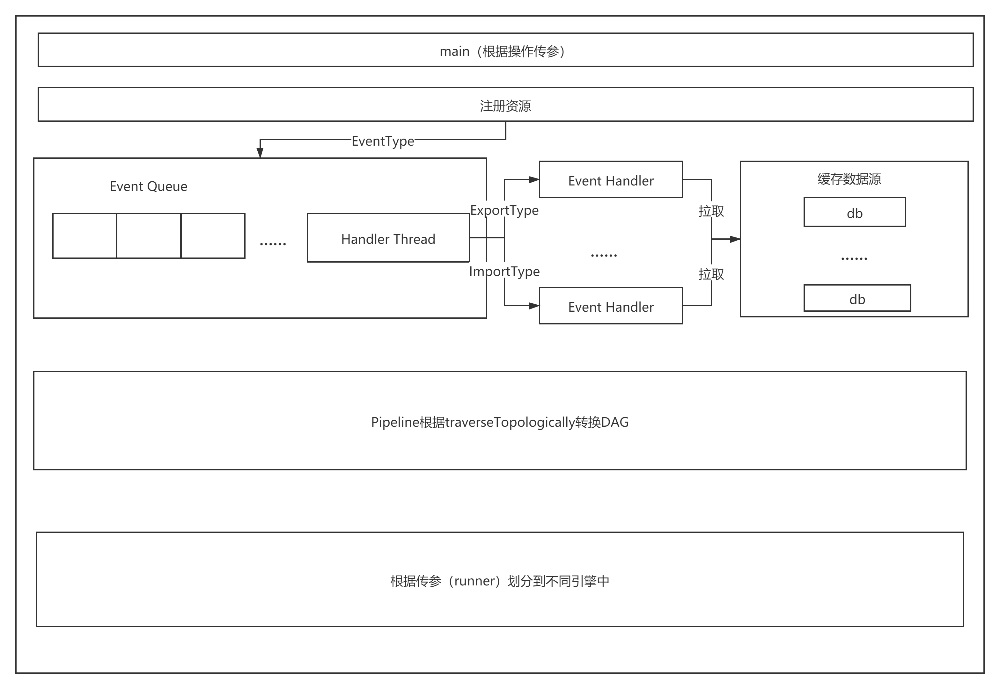
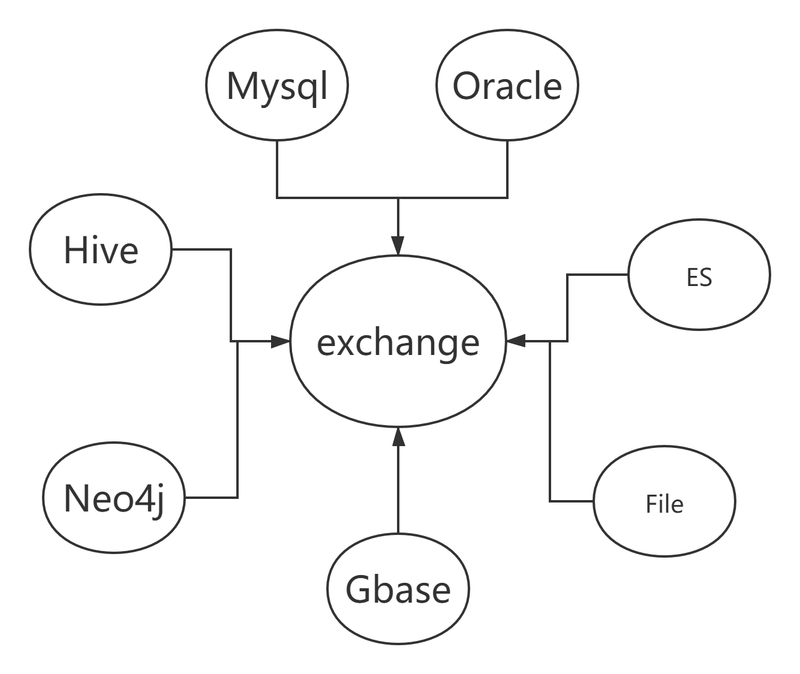

## 一.项目简介

exchange是要打造一个轻量级，高扩展性的数据交换平台，支持对结构化及无结构化的异构数据源之间的数据传输，在应用层上具有数据权限管控、节点服务高可用和多租户资源隔离等业务特性，而在数据层上又具有传输架构多样化、模块插件化和组件低耦合等架构特点。

exchange的传输能力依赖于Apache Beam链路计算的能力，再由事件模型扩展并发能力，最后处理成DAG应用，可以分发到不同的引擎上。


>客户端

类似与Sqoop操作，核心功能导入/导出，把每个操作基于事件模型并发处理，根据Beam计算模型生成DAG应用。

>服务端

可视化操作，传输交换能力依赖于其底层聚合的传输引擎，其顶层对各类数据源定义统一的参数模型，每种传输引擎对参数模型进行映射配置，转化为引擎的输入模型,可视化操作。（尚未开源）

>核心特点
* I/O 高效扩展性（根据Beam规范，扩展）。
* 数据源管理，目前支持Mysql，Oracle，Hive，Neo4j，Elasticsearch，Gbase，File。
* 多传输引擎支持(扩展引擎)，目前支持Java，Spark，Flink引擎。
* 近实时任务管控
* 支持无结构化传输
* 任务状态自检
* 各个源根据事件互通传输
## 二.编译部署

### 2.1 客户端

>环境准备

JDK (1.8.0_141) 必选

Spark (2.x) 可选

Flink (1.6.x) 可选

Hadoop 2.7以上

Hive 1.2.1以上

若需要 oralce 把pom注释打开

若需要 gbase 把pom注释打开

如不满足，可以修改pom文件，重新编译

>编译

当前项目环境下编译

示例：D:\\exchange-parent> mvn clean package

>执行文件

kd-process-0.1.0-shaded.jar

## 三.快速使用

### 3.1 客户端

具体参数含义，请看开发规范

```plain
spark2-submit  --driver-memory 2G --executor-memory 5G --executor-cores 3 --num-executors 3  --conf spark.default.para
llelism=200 --conf spark.sql.shuffle.partitions=200  --class com.knowlegene.parent.process.SwapSparkApplication  --mas
ter yarn   /mnt/jars/kd-process-0.1.0-shaded.jar  --fromName=mysql --toName=hive --hiveClass=org.apache.hive.jdbc.Hive
Driver --hiveUrl=jdbc:hive2://192.168.200.117:10000/linkis_db  --hiveUsername=hdfs --hivePassword=hdfs --hiveTableName
=per_test1 --hiveTableEmpty=true  --url=jdbc:mysql://192.168.100.101:3306/dt?useSSL=false --tableName=companykeyrate -
-driverClass=com.mysql.jdbc.Driver --username=dt --password=Dt@654321  --runner=SparkRunner  --sparkMaster=yarn  
```
## 四.底层已支持计算存储引擎

### 4.1 客户端

>Spark

com.knowlegene.parent.process.SwapSparkApplication 这个时入口程序，

--runner=SparkRunner  --sparkMaster=yarn  这两个Beam参数必传，具体用Spark的yarn，local，standalone 看需求。具体操作规范请看Beam([https://beam.apache.org/documentation/](https://beam.apache.org/documentation/))。

```plain
spark2-submit  --driver-memory 2G --executor-memory 5G --executor-cores 3 --num-executors 3  --conf spark.default.para
llelism=200 --conf spark.sql.shuffle.partitions=200  --class com.knowlegene.parent.process.SwapSparkApplication  --mas
ter yarn   /mnt/jars/kd-process-0.1.0-shaded.jar  --fromName=mysql --toName=hive --hiveClass=org.apache.hive.jdbc.Hive
Driver --hiveUrl=jdbc:hive2://192.168.200.117:10000/linkis_db  --hiveUsername=hdfs --hivePassword=hdfs --hiveTableName
=per_test1 --hiveTableEmpty=true  --url=jdbc:mysql://192.168.100.101:3306/dt?useSSL=false --tableName=companykeyrate -
-driverClass=com.mysql.jdbc.Driver --username=dt --password=Dt@654321  --runner=SparkRunner  --sparkMaster=yarn  
```
>Java

com.knowlegene.parent.process.SwapDirectApplication 这个时入口程序，

根据java -cp 传参运行，具体操作规范请看Beam([https://beam.apache.org/documentation/](https://beam.apache.org/documentation/))

>Flink

com.knowlegene.parent.process.SwapFlinkApplication 这个时入口程序，

```plain
mvn exec:java -Dexec.mainClass=org.apache.beam.examples.WordCount \
    -Pflink-runner \
    -Dexec.args="--runner=FlinkRunner \
      --inputFile=/path/to/pom.xml \
      --output=/path/to/counts \
      --flinkMaster=<flink master url> \
      --filesToStage=target/word-count-beam-bundled-0.1.jar"
```
具体操作规范请看Beam([https://beam.apache.org/documentation/](https://beam.apache.org/documentation/))
## 五.架构文档

>客户端



>支持数据源



## 六.开发规范

### 6.1 客户端传参规范

>入口

| 参数   | 含义   | 
|:----|:----|
| fromName   | 起始数据源（hive,oracle,mysql,es,file,gbase,neo4j）   | 
| toName   | 目标数据源（hive,oracle,mysql,es,file,gbase,neo4j）   | 
| runner   | 引擎名称（SparkRunner，FlinkRunner）   | 

更多引擎参数

FlinkPipelineOptions

SparkPipelineOptions

>Hive

| 参数   | 含义   | 
|:----|:----|
| hiveClass   | org.apache.hive.jdbc.HiveDriver   | 
| hiveUrl   | hive jdbc url   | 
| hiveUsername   | 用户名   | 
| hivePassword   | 密码   | 
| hiveTableName   | 表名称   | 
| hiveDatabase   | 库名称   | 
| hiveTableEmpty   | 是否清空目标表数据，默认不清空（false）   | 
| hiveSQL   | hive sql   | 
| hiveColumn   | 起始，目标，元数据的列字段   | 
| hMetastoreHost   | Hcatalog host   | 
| hMetastorePort   | Hcatalog port   | 
| hiveFilter   | Hcatalog 过滤条件   | 
| hivePartition   | 分区，json ,示例（{“time”:"2019"}）   | 
| hiveUrls   | 起始源和目标源都是Hive，url数组   | 
| hiveUsernames   | 起始源和目标源都是Hive，用户数组   | 
| hivePasswords   | 起始源和目标源都是Hive，密码数组   | 
| hiveTableNames   | 起始源和目标源都是Hive，表名称数组   | 
| hiveDatabases   | 起始源和目标源都是Hive，库名称数组   | 
| hMetastoreHosts   | 起始源和目标源都是Hive，Hcatalog host数组   | 
| hMetastorePorts   | 起始源和目标源都是Hive，Hcatalog port数组   | 

>Mysql

| 参数   | 含义   | 
|:----|:----|
| url   | jdbc url   | 
| tableName   | 表名称   | 
| username   | 用户名称   | 
| password   | 密码   | 
| driverClass   | driver class   | 
| dbSQL   | sql   | 
| dbColumn   | 起始，目标，元数据的列字段   | 
| driverClasss   | 起始源和目标源都是db   | 
| urls   | 起始源和目标源都是db   | 
| tableNames   | 起始源和目标源都是db   | 
| usernames   | 起始源和目标源都是db   | 
| passwords   | 起始源和目标源都是db   | 

>Elasticsearch

| 参数   | 含义   | 
|:----|:----|
| esAddrs   | es 地址   | 
| esIndex   | 索引   | 
| esType   | 类型，7版本必须_doc   | 
| esQuery   | 查询   | 
| esIdFn   | 根据字段赋值_id   | 
| esAddrsFrom   | 起始源和目标源都是es   | 
| esAddrsTo   | 起始源和目标源都是es   | 
| esIndexs   | 起始源和目标源都是es   | 
| esTypes   | 起始源和目标源都是es   | 
| nestingKeysName   | 嵌套名称   | 
| nestingKeys   | 根据key嵌套   | 
| nestingValues   | 嵌套数组中value   | 

>Neo4j

| 参数   | 含义   | 
|:----|:----|
| cypher   | cypher   | 
| neoUrl   | url   | 
| neoUsername   | 用户名称   | 
| neoPassword   | 密码   | 
| neoFormat   | 导出模板，具体看测试用例   | 
| neoType   | 类型，起始数据源为Neo4j，节点（node）/关系(relate)   | 
| cyphers   | 起始源和目标源都是neo4j   | 
| neoUrls   | 起始源和目标源都是neo4j   | 
| neoUsernames   | 起始源和目标源都是neo4j   | 
| neoPasswords   | 起始源和目标源都是neo4j   | 

>Oracle

| 参数   | 含义   | 
|:----|:----|
| url   | jdbc url   | 
| tableName   | 表名称   | 
| username   | 用户名称   | 
| password   | 密码   | 
| driverClass   | driver class   | 
| dbSQL   | sql   | 
| dbColumn   | 起始，目标，元数据的列字段   | 
| driverClasss   | 起始源和目标源都是db   | 
| urls   | 起始源和目标源都是db   | 
| tableNames   | 起始源和目标源都是db   | 
| usernames   | 起始源和目标源都是db   | 
| passwords   | 起始源和目标源都是db   | 

>Gbase

| 参数   | 含义   | 
|:----|:----|
| url   | jdbc url   | 
| tableName   | 表名称   | 
| username   | 用户名称   | 
| password   | 密码   | 
| driverClass   | driver class   | 
| dbSQL   | sql   | 
| dbColumn   | 起始，目标，元数据的列字段   | 
| driverClasss   | 起始源和目标源都是db   | 
| urls   | 起始源和目标源都是db   | 
| tableNames   | 起始源和目标源都是db   | 
| usernames   | 起始源和目标源都是db   | 
| passwords   | 起始源和目标源都是db   | 

>File

| 参数   | 含义   | 
|:----|:----|
| filePath   | 文件路径   | 
| fieldDelim   | 文件分隔符   | 
| fieldTitle   | 文件字段名称   | 
| filePaths   | 起始源和目标源都是file   | 
| fieldDelims   | 起始源和目标源都是file   | 

### 6.2 测试用例

>参考

com.knowlegene.parent.process 里面包括所有源测试用例

## 七.问题

1.Hive版本1.2以上，不然只能使用jdbc，无法使用HCatalog

2.Neo4j 多Type用模板方式导出，否则建议用cypher，具体情况，看测试用例

3.Gbase,Oracle jar 自行引入，pom中注释了

4.Neo4j 模板方式导出，id:ID(Node) 固定，node表示节点名称。

5.es的嵌套当前版本只支持一个。

6.有的引擎若用不到自行删除。

7.推荐HCatalog。

8.Hive jdbc 性能不好，不建议用java引擎，用Spark/Flink。

9.关于Beam教程[https://gitbook.cn/gitchat/activity/5dad728e7c3fea79dbc619a4](https://gitbook.cn/gitchat/activity/5dad728e7c3fea79dbc619a4)

10.Oracle number类型时，不支持转换为浮点类型。

## 八.总结

后续继续开源，欢迎交流，欢迎Star/Fork。


